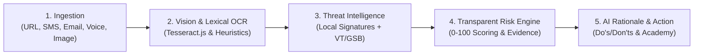

<div align="center">

# 🛡️ ThreatLens AI
### Evidence-Based Digital Threat Analyzer & Cognitive Defense Sandbox
**GeeksforGeeks Code Sangam Hackathon 2026 | Problem Statement PS-06: “Understanding Digital Threats”**

[](https://threatlens-ai-60k2.onrender.com/)
[](https://github.com/architcoder1234/threatlens-ai)
[](https://nodejs.org/)
[](https://react.dev/)
[](https://tailwindcss.com/)
[](LICENSE)

<br />

> *"We don't just detect digital threats. We explain why they are dangerous. We teach users how to recognize the next one."*

</div>

---

## 📑 Table of Contents
1. [🌟 Project Overview & Vision](#-project-overview--vision)
2. [🎯 Problem Statement (PS-06) & The Gap](#-problem-statement-ps-06--the-gap)
3. [💡 Core Innovation & 5-Stage Defense Pipeline](#-core-innovation--5-stage-defense-pipeline)
4. [🚀 Multi-Vector Threat Analysis Capabilities](#-multi-vector-threat-analysis-capabilities)
5. [⚖️ Transparent Rule-Based Risk Engine (0-100)](#️-transparent-rule-based-risk-engine-0-100)
6. [🎮 Interactive Threat Sandbox & Attack Simulator](#-interactive-threat-sandbox--attack-simulator)
7. [🌐 Multilingual Cyber Academy (Regional Languages)](#-multilingual-cyber-academy-regional-languages)
8. [🎨 Multi-Theme Cybersecurity Engine](#-multi-theme-cybersecurity-engine)
9. [🏛️ Architecture & Data Flow Diagram](#️-architecture--data-flow-diagram)
10. [🛠️ Tech Stack & Dependencies](#️-tech-stack--dependencies)
11. [🧪 Automated Test Suite (33/33 Tests)](#-automated-test-suite-3333-tests)
12. [📋 Hackathon Compliance & Mandatory AI Disclosures](#-hackathon-compliance--mandatory-ai-disclosures)
13. [💻 Installation & Local Quickstart](#-installation--local-quickstart)
14. [📜 REST API Specification](#-rest-api-specification)
15. [🔒 Zero-Trust Privacy Architecture](#-zero-trust-privacy-architecture)
16. [🗺️ Future Scope & Product Roadmap](#️-future-scope--product-roadmap)

---

## 🌟 Project Overview & Vision

**ThreatLens AI** is an evidence-based digital threat analyzer designed to democratize cybersecurity awareness. Built specifically for ordinary, non-technical users, ThreatLens shifts cybersecurity defense away from opaque, fear-driven black-box verdicts ("Safe" vs "Unsafe") toward **transparent cognitive empowerment**.

### The Core Philosophy:
$$\textbf{DETECT} \longrightarrow \textbf{EXPLAIN} \longrightarrow \textbf{SHOW EVIDENCE} \longrightarrow \textbf{RECOMMEND ACTION} \longrightarrow \textbf{EDUCATE}$$

Users don't just find out whether content is malicious; they understand the psychological coercion, inspect the exact indicators responsible, receive immediate actionable defensive steps, and practice defending themselves against future threats in an interactive sandbox.

---

## 🎯 Problem Statement (PS-06) & The Gap

### The Problem:
- Millions of internet users fall victim to look-alike domain phishing, smishing urgency traps, UPI QR-code reversal fraud, executive email spoofing, and fake "Digital Arrest" video calls daily.
- Existing security tools and browser extensions issue opaque binary verdicts without explanation.
- Because victims are not taught *how* the deception operates, they remain vulnerable to the next subtle variation of the scam.

### How ThreatLens Solves It:
- **Transparent Mathematical Scoring:** Itemized `0–100` score breakdown showing exactly what signals contributed to the risk estimate.
- **Visual Evidence Extraction:** Direct highlighting and quotation of malicious triggers from the input content.
- **Defense Playbooks:** Explicit **❌ Avoid These Actions (Don'ts)** and **✅ Recommended Next Steps (Do's)**.
- **Attack Simulation:** An interactive sandbox allowing users to make defensive decisions against simulated attackers without financial risk.

---

## 💡 Core Innovation & 5-Stage Defense Pipeline



1. **DETECT:** Lexical tokenization, domain parsing, visual OCR extraction, and threat intelligence lookups.
2. **EXPLAIN:** Prominent **"WHY IS THIS SUSPICIOUS?"** cards explaining attacker manipulation in plain language.
3. **SHOW EVIDENCE:** Direct quotes and structural anomalies extracted from the submitted payload.
4. **RECOMMEND ACTION:** Contextual defense checklists tailored to the specific threats identified.
5. **EDUCATE:** Interactive learning modules, localized regional language translations, and scenario quizzes.

---

## 🚀 Multi-Vector Threat Analysis Capabilities

| Threat Vector | Analysis Capabilities & Heuristic Rules |
| :--- | :--- |
| **🔗 URL Analyzer** | Protocol verification (HTTP vs HTTPS), direct IP hosts, brand keyword stuffing, subdomain nesting (`brand.com.attacker.xyz`), security hyphenation deception, homoglyphs, and high-risk abuse TLDs (`.xyz`, `.top`, `.tk`, `.ml`, `.click`). |
| **💬 SMS / WhatsApp Message** | Psychological urgency triggers (*"within 1 hour"*, *"account blocked today"*), credential harvesting requests, lottery scams, advance-fee fraud, and extracted link audits. |
| **📧 Email & BEC Inspector** | Sender/domain mismatch detection (executives using free `@gmail.com` webmail), high-pressure subject lines, fraudulent invoice wire demands, and embedded link verification. |
| **📸 Screenshot OCR Vision** | Client/backend optical character recognition powered by **Tesseract.js**. Extracts visible text from WhatsApp screenshots, payment confirmations, and SMS alerts before executing the analysis pipeline. |
| **💳 Payment & UPI Fraud** | Specialized detection of **"Scan QR to receive money"** or **"Enter UPI PIN to claim cashback"** inversion traps, fake buyer escrow deceptions, and advance processing fee scams. |
| **🎙️ Voice Call / Vishing** | Audits phone transcripts for fake law enforcement intimidation (*"Digital Arrest"*, *"CBI/Customs narcotics warrant"*), psychological isolation demands, and remote screen-sharing tools (*AnyDesk, TeamViewer*). |

---

## ⚖️ Transparent Rule-Based Risk Engine (0-100)

ThreatLens utilizes an explainable, accumulative scoring engine rather than an unverified black-box claim:

| Score Range | Threat Level | Color Scheme | Analytical Interpretation |
| :---: | :---: | :---: | :--- |
| **0 – 20** | **LOW RISK** | 🟢 Emerald | No strong threat indicators detected based on available heuristics. Exercise standard caution. |
| **21 – 50** | **MEDIUM RISK** | 🟡 Amber | Potential risk patterns detected. Independent verification recommended before interacting. |
| **51 – 75** | **HIGH RISK** | 🟠 Orange | High probability of phishing, impersonation, or financial deception. Avoid clicking links. |
| **76 – 100** | **CRITICAL RISK** | 🔴 Red | Strong evidence of malicious intent identified. Cease all communication immediately. |

### Sample Explainable Score Breakdown:
```
+25  Look-alike Brand Impersonation (Google)
+20  High-Risk Abuse Top-Level Domain (.xyz)
+18  Suspicious Security Keyword Hyphenation
+15  Unencrypted HTTP Protocol Connection
+18  Multi-Vector Threat Correlation Bonus
────────────────────────────────────────────────────
Total Risk Index: 96 / 100  (CRITICAL RISK)
```

> **Important Safety Notice:** Scoring is clearly labeled as an *analytical risk estimate* heuristic and does not guarantee absolute security. ThreatLens adheres to the safety principle of never claiming content is "100% Safe".

---

## 🎮 Interactive Threat Sandbox & Attack Simulator

Located under the **"Threat Sandbox"** tab, this live training simulator immerses users in authentic threat scenarios:
- **Scenario 1: Marketplace UPI QR Buyer Scam** (Demonstrates how scammers trick sellers into entering their PIN to "receive" funds).
- **Scenario 2: "Digital Arrest" & Fake Police Video Call** (Explains psychological isolation and legal realities of fake law enforcement calls).
- **Scenario 3: Subdomain Lookalike Phishing** (Tests the user's ability to spot deceptive subdomain prefixes vs root domains).

### Features:
- **Mock Attacker Interfaces:** Realistic rendering of deceptive prompts, fake dialogues, and deceptive URLs.
- **X-Ray Clues Mode:** Users can toggle hidden evidence signals before submitting their decision.
- **Immediate Outcome Feedback:** Explains what would have happened in real life based on the user's choices.

---

## 🌐 Multilingual Cyber Academy (Regional Languages)

ThreatLens includes a built-in learning center with interactive modules on Phishing, Smishing, Social Engineering, Credential Theft, UPI Scams, and Executive BEC.

### Native Language Localization:
Users can switch between languages instantly:
- 🇬🇧 **English (EN)**
- 🇮🇳 **हिंदी (Hindi)**
- 🇮🇳 **தமிழ் (Tamil)**
- 🇮🇳 **తెలుగు (Telugu)**

Includes an interactive **Cyber Reflex Quiz** with automatic score calculation, celebratory confetti on mastery, and detailed explanations of **why** each answer is correct.

---

## 🎨 Multi-Theme Cybersecurity Engine

Users can customize their security operations environment from the top navigation bar or the dedicated **Settings** page:
1. 🩵 **Cyber Slate (Default Cyan):** Modern glassmorphism cybersecurity dashboard.
2. 💚 **Matrix Terminal (Hacker Emerald):** High-contrast terminal green on pitch-black background.
3. 🔴 **Red Team Ops (Crimson / Rose):** High-alert SOC red and dark burgundy theme.
4. 💜 **Midnight Purple (Violet Deep):** Deep indigo night mode.

---

## 🏛️ Architecture & Data Flow Diagram

```
[ USER INTERACTION ]
  │── URL / Link
  │── SMS / WhatsApp Text
  │── Email Body & Headers
  │── Screenshot Upload
  │── Payment Request
  │── Voice Transcript
        │
        ▼
[ FRONTEND LAYER (React + Vite + Tailwind CSS) ]
  │── Dynamic Visual Theme Engine (LocalStorage Persistence)
  │── Multi-Vector Scanner Interfaces & Quick-Scan Hero Bar
  │── Interactive Threat Sandbox Arena
  │── Multilingual Cyber Academy & Interactive Quiz Engine
  │── 1-Click WhatsApp Threat Brief Copy & PDF Report Exporter
        │  (REST API via HTTPS / Proxy)
        ▼
[ BACKEND SERVICE LAYER (Node.js + Express) ]
  │── Security Middleware: Helmet, CORS, Rate-Limiting (120 req/min)
  │── Multer In-Memory Multipart Image Upload Parser
  │── Tesseract.js Multithreaded Vision OCR Worker
  │── Lexical & Domain Analyzers (urlAnalyzer, messageAnalyzer, emailAnalyzer, audioAnalyzer)
  │── Threat Intelligence Service (Local Signature DB + VT/GSB Connectors)
  │── Transparent Risk Engine (Mathematical Point Accumulator & Category Correlator)
  │── AI & LLM Explanation Layer (Gemini/OpenAI with Deterministic Fallback Synthesis)
  │── Recommendation Service (Contextual Do's and Don'ts Playbooks)
  │── Sanitized History Cache (Zero Credential Storage, In-Memory/Disk Store)
```

---

## 🛠️ Tech Stack & Dependencies

### Frontend:
- **Core:** React 18.3, Vite 8.3
- **Styling & Icons:** Tailwind CSS v4, Lucide React Icons
- **Visuals & Effects:** Canvas Confetti, Recharts
- **Networking:** Native Fetch API with resilient error boundaries

### Backend:
- **Runtime & Framework:** Node.js (v24+ / v18+ LTS), Express.js 4.21
- **Security & Reliability:** Helmet 8.0, Express-Rate-Limit 7.5, CORS 2.8
- **Vision OCR:** Tesseract.js 5.1
- **File Ingestion:** Multer (In-Memory Buffer Processing)
- **HTTP Client:** Axios 1.7
- **AI / LLM Integration:** Google Gemini API / OpenAI Compatible Layer

---

## 🧪 Automated Test Suite (33/33 Tests)

ThreatLens AI includes a comprehensive automated test suite verifying every layer of the application:

```bash
cd backend
node test_suite.js
```

### Verified Test Results:
```text
====================================================
🛡️  THREATLENS AI COMPREHENSIVE AUTOMATED TEST SUITE
====================================================

1. Testing System Health...
  ✅ PASS: Health endpoint responds with 200
  ✅ PASS: System reports status ONLINE
  ✅ PASS: Project identifier matches

2. Testing URL Analyzer with Malicious URL...
  ✅ PASS: URL analysis responds with 200
  ✅ PASS: Risk score is high/critical (100/100)
  ✅ PASS: Categorized as Phishing / Malicious Link
  ✅ PASS: Why is this suspicious indicators extracted
  ✅ PASS: Transparent score breakdown generated
  ✅ PASS: Safety Don'ts recommended

3. Testing URL Analyzer with Legitimate URL...
  ✅ PASS: Clean URL responds with 200
  ✅ PASS: Clean URL has low risk score (0/100)
  ✅ PASS: Risk level marked LOW

4. Testing Message Analyzer with Fake Bank Smishing...
  ✅ PASS: Message analysis responds with 200
  ✅ PASS: Smishing score is critical (100/100)
  ✅ PASS: Categorized as Credential Theft / Social Engineering
  ✅ PASS: Urgency and Credential indicators identified

5. Testing Email Analyzer with CEO Wire Scam...
  ✅ PASS: Email analysis responds with 200
  ✅ PASS: Email fraud score is high (100/100)
  ✅ PASS: Impersonation on free mailbox detected

6. Testing Payment Analyzer with UPI Receiving Trap...
  ✅ PASS: Payment analysis responds with 200
  ✅ PASS: Payment fraud score is critical (62/100)
  ✅ PASS: UPI PIN receive deception detected

7. Testing History Management APIs...
  ✅ PASS: History returns an array
  ✅ PASS: History contains recorded scans
  ✅ PASS: Single report fetched by ID matches
  ✅ PASS: Report deleted successfully

8. Testing Cyber Academy & Demo Endpoints...
  ✅ PASS: Academy modules count >= 5 (6)
  ✅ PASS: Quiz questions count >= 5 (5)
  ✅ PASS: Curated demo scenarios >= 5 (7)

9. Testing Interactive Quiz Grading Engine...
  ✅ PASS: Quiz submission returns 200
  ✅ PASS: Quiz perfect score achieved (5/5)
  ✅ PASS: Percentage is 100%
  ✅ PASS: All quiz questions have detailed WHY explanations

====================================================
🏁 TEST RESULTS: 33/33 TESTS PASSED (100%)
====================================================
```

---

## 📋 Hackathon Compliance & Mandatory AI Disclosures

In full compliance with **GeeksforGeeks Code Sangam Hackathon 2026 rules on AI tool disclosure and originality**:

1. **AI & API Disclosures:**
   - **Google Gemini API / OpenAI API:** Leveraged securely strictly from backend environment variables for natural language threat summarization and reasoning assistance, augmented by custom rule-based deterministic heuristics and offline NLP synthesis.
   - **Tesseract.js OCR:** Open-source vision OCR used for visual character extraction from uploaded images.
   - **No Secrets in Frontend:** API keys and environment variables are strictly restricted to the backend service.
2. **Originality & Authorship:**
   - All heuristic parsing rules, risk calculation algorithms, Threat Sandbox simulation scenarios, multi-theme engines, and UI designs were authored and developed within the official hackathon duration.

---

## 💻 Installation & Local Quickstart

### Prerequisites
- [Node.js](https://nodejs.org/) (v18.0 or higher)
- [npm](https://www.npmjs.com/) (v9.0 or higher)
- [Git](https://git-scm.com/)

### Step 1: Clone Repository
```bash
git clone https://github.com/architcoder1234/threatlens-ai.git
cd threatlens-ai
```

### Step 2: Install Dependencies & Build
```bash
# Unified install and build command
npm run install:all
npm run build
```

### Step 3: Run the Application
```bash
npm start
```
- 🖥️ **Fullstack Web Application:** Open [http://localhost:5000](http://localhost:5000) (or `http://localhost:5173` if running Vite dev server).
- 🩺 **Health Check:** [http://localhost:5000/health](http://localhost:5000/health)

---

## 📜 REST API Specification

| Method | Endpoint | Description | Sample Request Body |
| :--- | :--- | :--- | :--- |
| `POST` | `/api/analyze/url` | Deep URL structure & brand inspection | `{ "url": "https://sbi-kyc.top/auth" }` |
| `POST` | `/api/analyze/message` | SMS / chat threat parsing | `{ "content": "Your account is blocked today..." }` |
| `POST` | `/api/analyze/email` | Header & body audit for BEC | `{ "sender": "...", "subject": "...", "body": "..." }` |
| `POST` | `/api/analyze/payment` | UPI / payment trap check | `{ "amount": "15000", "payee": "...", "note": "..." }` |
| `POST` | `/api/analyze/audio` | Voice call / vishing transcript check | `{ "transcript": "CBI Officer calling..." }` |
| `POST` | `/api/analyze/screenshot` | OCR image text extraction | Multipart form-data (`screenshot` file) |
| `GET` | `/api/history` | Retrieve past sanitized scans | — |
| `DELETE`| `/api/history/:id` | Purge a specific report | — |
| `DELETE`| `/api/history` | Purge all scan history | — |
| `GET` | `/api/learning` | Fetch Academy modules & quiz | — |
| `POST` | `/api/quiz/submit` | Grade interactive quiz | `{ "answers": { "q1": 1, "q2": 2 } }` |
| `GET` | `/api/demo` | Fetch curated live test demos | — |

---

## 🔒 Zero-Trust Privacy Architecture

1. **Zero Credential Storage:** ThreatLens never stores passwords, 6-digit OTPs, Aadhaar numbers, PAN cards, or UPI PINs.
2. **Data Sanitization on Ingestion:** Analysis records are automatically filtered and stripped of sensitive parameters before saving to history.
3. **User Sovereignty:** Users can delete individual records or permanently purge their entire local history cache with one click.
4. **Backend Secret Isolation:** Threat intelligence and LLM keys remain strictly in private server environment variables.

---

## 🗺️ Future Scope & Product Roadmap

- **Phase 1 (Shipped / Live):** Multi-vector heuristic scanning, Tesseract OCR, explainable risk scoring (0-100), Attack Sandbox Simulator, Multilingual Academy, and 4-theme engine.
- **Phase 2 (In Development):** Automated DKIM/SPF/DMARC email header verification and live speech-to-text audio recording analyzer.
- **Phase 3 (Upcoming):** Browser extension for real-time DOM form field inspection, decentralized community honeypot telemetry, and WhatsApp/Telegram Automated Scam Reporter Bot.

---

<div align="center">

**ThreatLens AI — GFG Code Sangam Hackathon 2026**  
*Built with ❤️ for everyday digital safety.*

[Live Demo](https://threatlens-ai-60k2.onrender.com/) • [GitHub Repository](https://github.com/architcoder1234/threatlens-ai)

</div>
